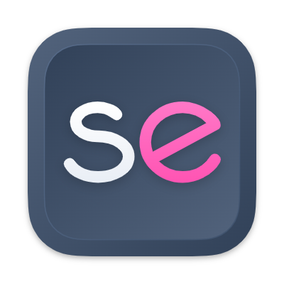

<div align="center">
  <br>
  <br>
  

  <br>
</div>

# sassed

> A simple editor to compile Sass code in your browser

This is the source code repository of the sassed app. You can find the app at [loilo.github.io/sassed](https://loilo.github.io/sassed/).

## Technologies

The core technologies this project uses are:

<!-- prettier-ignore -->
Technology | Purpose
-|-
**[Codemirror](https://codemirror.net/)** | A text/code editor, used for the editing area itself.
**[Nuxt](https://nuxt.com/)** | An application framework for Vue.js, used for prerendering, PWA support and overall application structure.
**[`lz-string`](https://www.npmjs.com/package/lz-string)** | A quick and space-efficient compression algorithm, used for serializing the current app state into a shareable URL in as few characters as possible.
**[GitHub Pages](https://pages.github.com/)** | This app does (purposefully) not generate any income. Therefore, free, scalable hosting is essential to keep it running.

## Setup

Clone this repository and install its dependencies using [npm](https://npmjs.com/).

```bash
npm ci
```

## Local Development

Start a local dev server with hot reloading:

```bash
npm run dev
```

## Generate Production Site

Create a production-ready site in the `dist` folder:

```
npm run generate
```

Set the `BASE_URL` environment variable to create a build that can be hosted in a subfolder of a domain, e.g.:

```
BASE_URL=/sassed/ npm run generate
```
